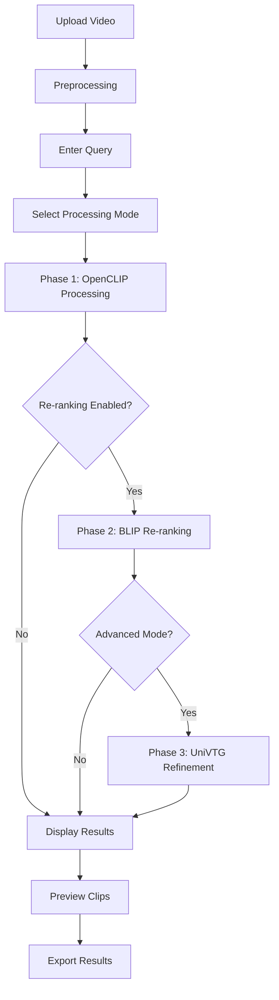

# Automatic Event Detection and Extraction from Video - Product Requirements Document

## 1. Product Overview

An intelligent video analysis system that automatically detects and extracts specific events from long-form videos using natural language queries. The system eliminates the need for manual video review by providing precise timestamps and extracted clips of relevant events.

- **Problem Solved**: Manual video analysis is time-consuming and inefficient for long videos like CCTV footage or recorded content.
- **Target Users**: Security professionals, content creators, researchers, and anyone needing to find specific events in video content.
- **Market Value**: Reduces video analysis time from hours to minutes, enabling real-time event monitoring and content discovery.

## 2. Core Features

### 2.1 User Roles

| Role | Registration Method | Core Permissions |
|------|---------------------|------------------|
| Standard User | Direct access | Can upload videos, submit queries, view results |
| Advanced User | API access | Can batch process, access advanced models, export data |

### 2.2 Feature Module

Our video event detection system consists of the following main components:

1. **Video Upload Interface**: File upload, format validation, preprocessing status
2. **Query Interface**: Natural language input, query history, result filtering
3. **Processing Dashboard**: Real-time progress, phase selection, model configuration
4. **Results Viewer**: Timeline visualization, clip preview, timestamp export
5. **Settings Panel**: Model selection, accuracy vs speed trade-offs, output preferences

### 2.3 Page Details

| Page Name | Module Name | Feature description |
|-----------|-------------|---------------------|
| Upload Interface | File Handler | Accept video files (MP4, AVI, MOV), validate format and size, display upload progress, queue management |
| Upload Interface | Preprocessing | Extract metadata, generate thumbnails, validate video integrity, estimate processing time |
| Query Interface | Text Input | Natural language query input with examples, query validation, syntax suggestions |
| Query Interface | Query History | Save previous queries, reuse queries, query templates for common events |
| Processing Dashboard | Phase Selection | Choose between MVP (fast), Re-ranked (balanced), or Advanced (accurate) processing modes |
| Processing Dashboard | Progress Monitor | Real-time processing status, estimated completion time, cancel/pause operations |
| Results Viewer | Timeline Display | Interactive timeline showing confidence scores, event markers, zoom/pan controls |
| Results Viewer | Clip Preview | Video player for extracted clips, frame-by-frame navigation, quality controls |
| Results Viewer | Export Tools | Download clips, export timestamps (CSV/JSON), share results, batch export |
| Settings Panel | Model Configuration | Select processing models, adjust confidence thresholds, performance vs accuracy settings |

## 3. Core Process

**Standard User Flow:**
1. User uploads video file through the upload interface
2. System validates and preprocesses the video
3. User enters natural language query describing the event to find
4. User selects processing mode (MVP/Re-ranked/Advanced)
5. System processes video through selected pipeline phases
6. Results are displayed on timeline with confidence scores
7. User previews and downloads relevant clips

**Advanced User Flow:**
1. API-based batch upload of multiple videos
2. Programmatic query submission with custom parameters
3. Advanced model configuration and threshold tuning
4. Automated result export and integration with external systems

## 4. User Interface Design

### 4.1 Design Style

- **Primary Colors**: Deep blue (#1e3a8a) for headers and primary actions, light blue (#3b82f6) for interactive elements
- **Secondary Colors**: Gray (#6b7280) for text, green (#10b981) for success states, red (#ef4444) for errors
- **Button Style**: Rounded corners (8px radius), subtle shadows, hover animations
- **Font**: Inter or system fonts, 14px base size, 16px for headings, 12px for captions
- **Layout Style**: Card-based design with clean spacing, top navigation bar, sidebar for tools
- **Icons**: Feather icons or similar minimalist style, consistent 20px size

### 4.2 Page Design Overview

| Page Name | Module Name | UI Elements |
|-----------|-------------|-------------|
| Upload Interface | File Handler | Drag-and-drop zone with dashed border, progress bars with percentage, file type icons |
| Upload Interface | Preprocessing | Status cards with loading spinners, thumbnail grid layout, metadata display tables |
| Query Interface | Text Input | Large text area with placeholder examples, suggestion dropdown, character counter |
| Query Interface | Query History | Scrollable list with timestamps, search/filter controls, favorite star icons |
| Processing Dashboard | Phase Selection | Radio button cards with descriptions, estimated time badges, model comparison table |
| Processing Dashboard | Progress Monitor | Animated progress bar, phase indicators, real-time log display |
| Results Viewer | Timeline Display | Horizontal timeline with zoom controls, confidence heat map, clickable event markers |
| Results Viewer | Clip Preview | Video player with custom controls, frame thumbnails, timestamp overlay |
| Results Viewer | Export Tools | Download buttons with format options, batch selection checkboxes, sharing modal |
| Settings Panel | Model Configuration | Slider controls for thresholds, toggle switches for features, performance indicators |

### 4.3 Responsiveness

Desktop-first design with mobile adaptation for viewing results. Touch-optimized controls for timeline navigation and clip preview on tablets. Responsive breakpoints at 768px and 1024px for optimal viewing across devices.