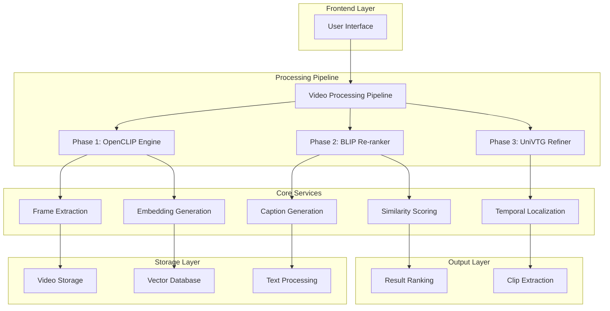
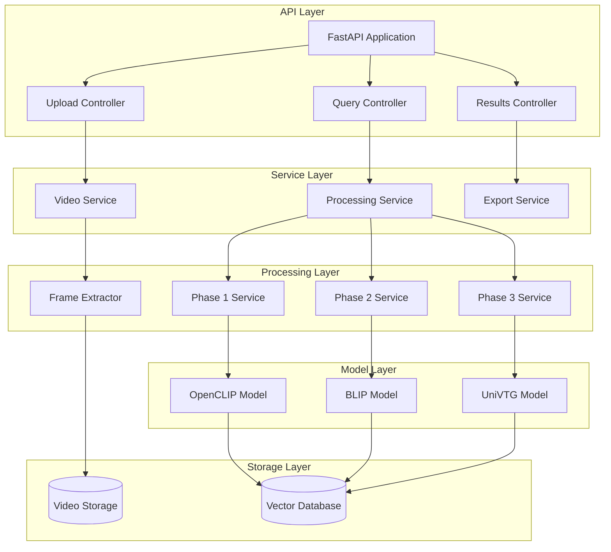
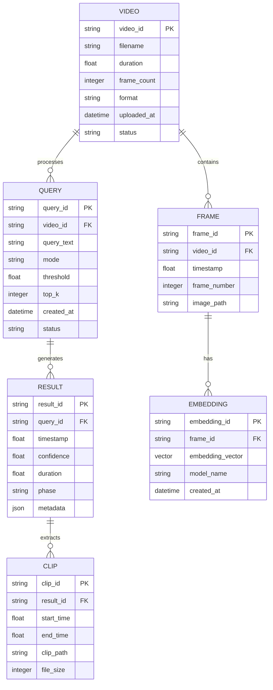

# Automatic Event Detection and Extraction from Video - Technical Architecture Document

## 1. Architecture Design



## 2. Technology Description

* **Frontend**: Python Streamlit/Gradio for web interface, OpenCV for video display

* **Backend**: Python FastAPI for API services, Celery for async processing

* **AI Models**: OpenCLIP (ViT-B/32), BLIP-2, UniVTG, Sentence Transformers

* **Video Processing**: Decord for frame extraction, FFmpeg for clip generation

* **Storage**: Local filesystem for videos, FAISS for vector similarity search

* **Dependencies**: PyTorch, Transformers, NumPy, Pandas

## 3. Route Definitions

| Route         | Purpose                                         |
| ------------- | ----------------------------------------------- |
| /             | Main interface for video upload and query input |
| /upload       | Video file upload and preprocessing status      |
| /process      | Processing pipeline execution and monitoring    |
| /results      | Timeline visualization and clip preview         |
| /api/upload   | REST API for video upload                       |
| /api/query    | REST API for event detection queries            |
| /api/status   | Processing status and progress tracking         |
| /api/download | Clip download and export functionality          |

## 4. API Definitions

### 4.1 Core API

**Video Upload**

```
POST /api/upload
```

Request:

| Param Name  | Param Type | isRequired | Description                     |
| ----------- | ---------- | ---------- | ------------------------------- |
| video\_file | file       | true       | Video file (MP4, AVI, MOV)      |
| video\_id   | string     | false      | Custom identifier for the video |

Response:

| Param Name   | Param Type | Description                          |
| ------------ | ---------- | ------------------------------------ |
| video\_id    | string     | Unique identifier for uploaded video |
| status       | string     | Upload status (success/error)        |
| duration     | float      | Video duration in seconds            |
| frame\_count | integer    | Total number of frames               |

**Event Detection Query**

```
POST /api/query
```

Request:

| Param Name | Param Type | isRequired | Description                             |
| ---------- | ---------- | ---------- | --------------------------------------- |
| video\_id  | string     | true       | Video identifier                        |
| query      | string     | true       | Natural language event description      |
| mode       | string     | false      | Processing mode (mvp/reranked/advanced) |
| top\_k     | integer    | false      | Number of top results to return         |
| threshold  | float      | false      | Confidence threshold (0.0-1.0)          |

Response:

| Param Name      | Param Type | Description                               |
| --------------- | ---------- | ----------------------------------------- |
| task\_id        | string     | Processing task identifier                |
| status          | string     | Task status (queued/processing/completed) |
| estimated\_time | integer    | Estimated completion time in seconds      |

**Results Retrieval**

```
GET /api/results/{task_id}
```

Response:

| Param Name            | Param Type | Description                |
| --------------------- | ---------- | -------------------------- |
| results               | array      | Array of detected events   |
| results\[].timestamp  | float      | Event timestamp in seconds |
| results\[].confidence | float      | Confidence score (0.0-1.0) |
| results\[].duration   | float      | Event duration in seconds  |
| results\[].clip\_url  | string     | URL to extracted clip      |

## 5. Server Architecture Diagram



## 6. Data Model

### 6.1 Data Model Definition



### 6.2 Data Definition Language

**Video Table**

```sql
CREATE TABLE videos (
    video_id VARCHAR(36) PRIMARY KEY,
    filename VARCHAR(255) NOT NULL,
    duration FLOAT NOT NULL,
    frame_count INTEGER NOT NULL,
    format VARCHAR(10) NOT NULL,
    uploaded_at TIMESTAMP DEFAULT CURRENT_TIMESTAMP,
    status VARCHAR(20) DEFAULT 'uploaded'
);

CREATE INDEX idx_videos_status ON videos(status);
CREATE INDEX idx_videos_uploaded_at ON videos(uploaded_at DESC);
```

**Frame Table**

```sql
CREATE TABLE frames (
    frame_id VARCHAR(36) PRIMARY KEY,
    video_id VARCHAR(36) NOT NULL,
    timestamp FLOAT NOT NULL,
    frame_number INTEGER NOT NULL,
    image_path VARCHAR(500),
    FOREIGN KEY (video_id) REFERENCES videos(video_id)
);

CREATE INDEX idx_frames_video_id ON frames(video_id);
CREATE INDEX idx_frames_timestamp ON frames(timestamp);
```

**Query Table**

```sql
CREATE TABLE queries (
    query_id VARCHAR(36) PRIMARY KEY,
    video_id VARCHAR(36) NOT NULL,
    query_text TEXT NOT NULL,
    mode VARCHAR(20) DEFAULT 'mvp',
    threshold FLOAT DEFAULT 0.5,
    top_k INTEGER DEFAULT 10,
    created_at TIMESTAMP DEFAULT CURRENT_TIMESTAMP,
    status VARCHAR(20) DEFAULT 'queued',
    FOREIGN KEY (video_id) REFERENCES videos(video_id)
);

CREATE INDEX idx_queries_video_id ON queries(video_id);
CREATE INDEX idx_queries_status ON queries(status);
```

**Results Table**

```sql
CREATE TABLE results (
    result_id VARCHAR(36) PRIMARY KEY,
    query_id VARCHAR(36) NOT NULL,
    timestamp FLOAT NOT NULL,
    confidence FLOAT NOT NULL,
    duration FLOAT DEFAULT 5.0,
    phase VARCHAR(20) NOT NULL,
    metadata JSON,
    FOREIGN KEY (query_id) REFERENCES queries(query_id)
);

CREATE INDEX idx_results_query_id ON results(query_id);
CREATE INDEX idx_results_confidence ON results(confidence DESC);
CREATE INDEX idx_results_timestamp ON results(timestamp);
```

**Clips Table**

```sql
CREATE TABLE clips (
    clip_id VARCHAR(36) PRIMARY KEY,
    result_id VARCHAR(36) NOT NULL,
    start_time FLOAT NOT NULL,
    end_time FLOAT NOT NULL,
    clip_path VARCHAR(500),
    file_size INTEGER,
    FOREIGN KEY (result_id) REFERENCES results(result_id)
);

CREATE INDEX idx_clips_result_id ON clips(result_id);
```

**Embeddings Table**

```sql
CREATE TABLE embeddings (
    embedding_id VARCHAR(36) PRIMARY KEY,
    frame_id VARCHAR(36) NOT NULL,
    embedding_vector BLOB NOT NULL,
    model_name VARCHAR(50) NOT NULL,
    created_at TIMESTAMP DEFAULT CURRENT_TIMESTAMP,
    FOREIGN KEY (frame_id) REFERENCES frames(frame_id)
);

CREATE INDEX idx_embeddings_frame_id ON embeddings(frame_id);
CREATE INDEX idx_embeddings_model_name ON embeddings(model_name);
```

